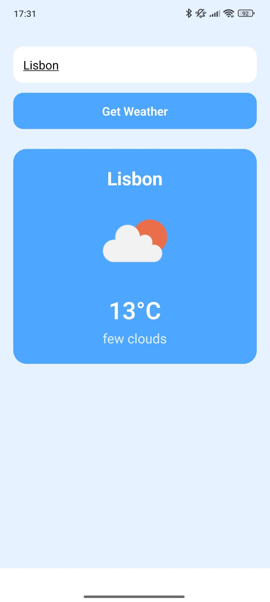

# WeatherApp

A **modern mobile weather app** built with **React Native, Expo Router, and TypeScript**.  
Enter a city to see current weather data from **OpenWeather API**.

---

## Features

- Search for any city worldwide
- Displays:
  - City name
  - Temperature (°C)
  - Weather description
  - Weather icon
- Loading indicator while fetching data
- Modern, responsive UI with rounded cards and soft colors

---

## Screenshots

